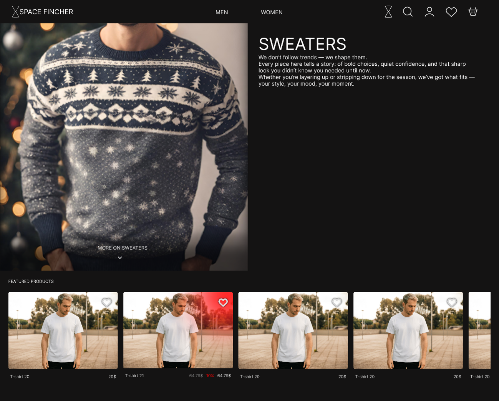
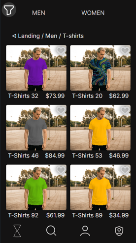
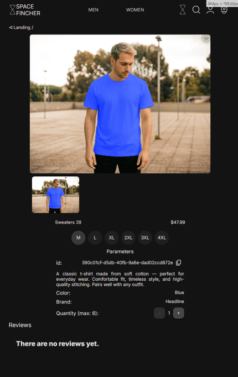
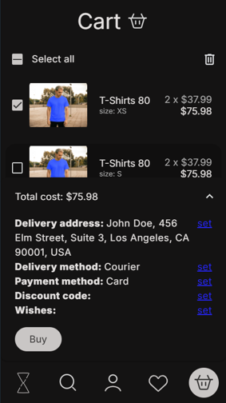
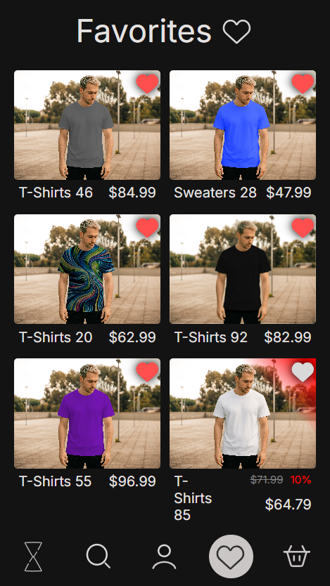
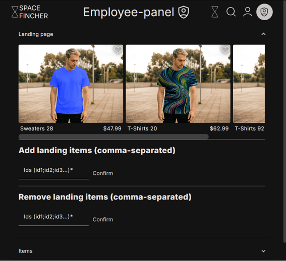
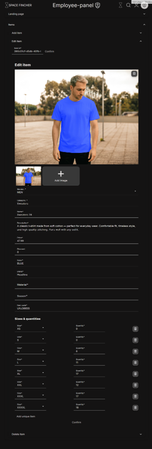

# Space Fincher Frontend

**Space Fincher** is a responsive clothing e-commerce frontend built with Angular. The application covers the main customer flow from browsing products to ordering, and also includes an employee panel for managing landing items and product data.

## Preview



| Catalog                                         | Product page                                  | Checkout                                               |
| ----------------------------------------------- | --------------------------------------------- | ------------------------------------------------------ |
|  |  |  |

## Features

- Landing page with featured products and gender/category navigation.
- Product catalog with category pages, breadcrumbs, filters and pagination.
- Product details page with image gallery, sizes, quantity selection, reviews, favorites and cart actions.
- Authentication flow: registration, login, account activation, password recovery and Google login button integration.
- Favorites, cart, checkout data and order history pages.
- Employee panel for managing landing items and creating, editing or deleting products.
- Responsive dark UI optimized for mobile screens while also supporting desktop layout.
- SSR-ready Angular setup with Docker and Nginx configuration.

## Tech Stack

- Angular 19
- Angular Material
- Angular Reactive Forms
- Angular Signals
- RxJS
- TypeScript
- JWT-based authentication
- Angular SSR
- Docker / Nginx

## Screenshots

### Catalog and product flow

| Catalog                                         | Product page                                  | Checkout                                               |
| ----------------------------------------------- | --------------------------------------------- | ------------------------------------------------------ |
|  |  |  |

### Favorites and employee panel

| Favorites                                           | Employee panel                                    |
| --------------------------------------------------- | ------------------------------------------------- |
|  |  |

### Item editor



## Requirements

- Node.js
- npm
- One of the following backend options:

  - real backend: [e-commerce-app](https://github.com/bekrenov-r/e-commerce-app)
  - local mock backend from the `json-server` folder

## Mock Backend

The project includes a small local mock backend inside the `json-server` folder.

It is used for frontend development when the real backend is not running.

```text
json-server
├── db.json
├── package.json
└── server.js
```

`json-server/server.js` is an Express-based mock server. It reads mock endpoint data from `db.json`, enables CORS for the Angular dev server and runs on port `8765`.

It also includes a mock login endpoint:

```text
POST /oauth2/login/basic
```

The frontend is configured to use the backend URL:

```ts
backendUrl: 'http://localhost:8765'
```

To start the mock backend:

```bash
cd json-server
npm install
npm start
```

Then start the Angular app in another terminal:

```bash
npm install
npm run start
```

The Angular app will be available at:

```text
http://localhost:4200
```

The mock backend will be available at:

```text
http://localhost:8765
```

For production-like usage, run the real backend instead of the mock server.

## Installation

```bash
npm install
```

## Development

```bash
npm run start
```

The application will be available at:

```text
http://localhost:4200
```

## Production Build

```bash
npm run build
```

## SSR

Build the application:

```bash
npm run build
```

Run the SSR server:

```bash
npm run serve:ssr
```

## Docker

The repository contains a `Dockerfile`, `compose.yaml` and `nginx.conf` for containerized deployment.

```bash
docker compose up --build
```

## Project Structure

```text
src/app
├── auth              # login, registration, activation and password recovery
├── categories        # categories, catalog, filters, item cards and pagination
├── employee          # employee panel and item editor
├── item              # product details, reviews, cart/favorite actions
├── navigation        # header and bottom navigation
├── order-page        # order details
├── shared            # reusable dialog, pipes and local services
└── tabs              # landing, search, account, cart and favorites pages
```

## Notes

This repository contains the frontend part of the e-commerce application. A running backend is required for authentication, products, cart, orders, reviews and employee management APIs.
